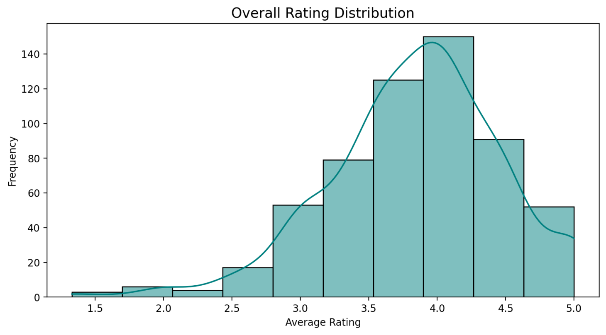
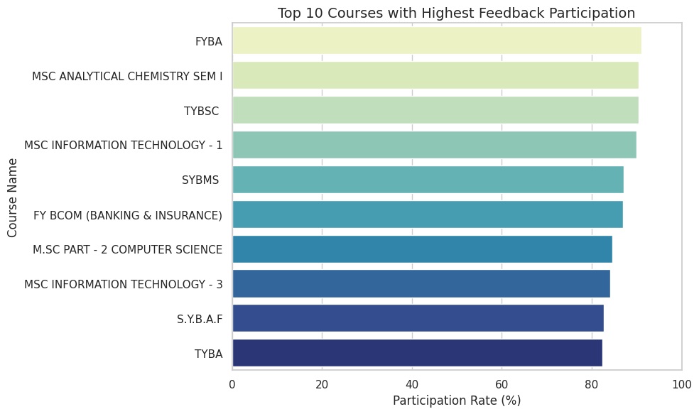
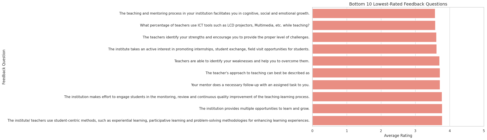
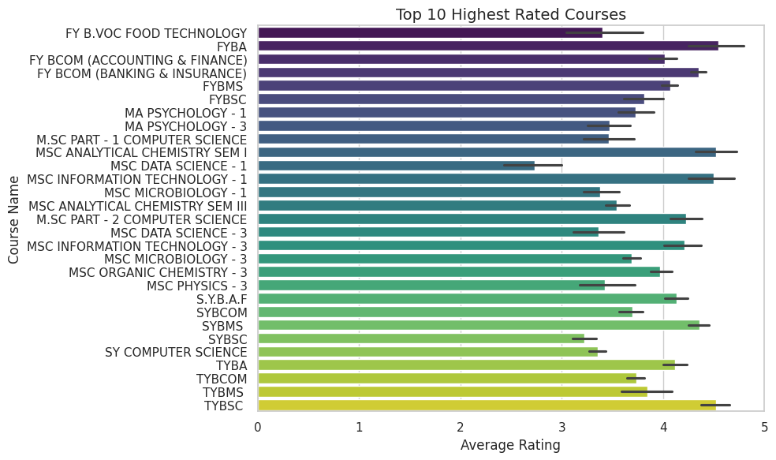
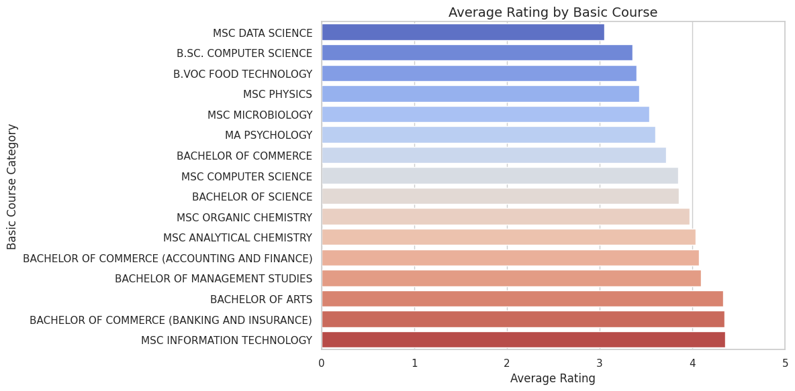
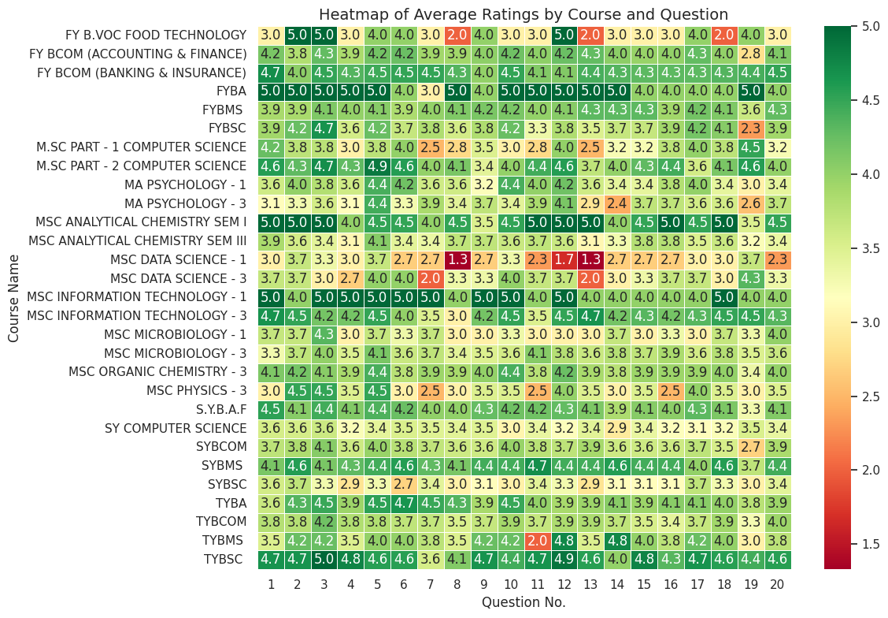

# 🎓 Student Feedback Analysis Dashboard

A data-driven project that analyzes student satisfaction survey data using Python and presents key insights via a **Streamlit dashboard**. This project aims to help educators, academic planners, and stakeholders better understand what’s working—and what needs improvement—in teaching and learning.

---

## 🔍 Overview

This project dives into student feedback responses from various academic streams and courses. It reveals patterns in satisfaction, identifies weak learning areas, and correlates participation with perceived course quality.

Built for **non-technical decision-makers** via a clean, interactive web app.

---

## 📂 Project Structure
student-feedback-analysis/
│
├── 📁 data/ → Dataset (CSV)
├── 📁 visuals/ → All saved graphs (PNG)
├── 📁 streamlit_app/ → Streamlit dashboard app.py
├── 📁 notebooks/ → EDA & analysis notebook
├── 📄 requirements.txt → Python dependencies
├── 📄 README.md → Project overview
├── 📄 LICENSE → MIT License

---

## 📊 Key Insights

Here are some visual highlights from the analysis:

| Insight Area                        | Preview |
|------------------------------------|---------|
| 🔍 **Overview**                    | |
| ⭐ **Top Rated Courses**           |  |
| ⚠️ **Weak Feedback Questions**     |  |
| 🧪 **Rating by Academic Stream**   |  |
| 👥 **Feedback Submission Counts**  |  |
| 🔁 **Rating vs Participation**     |  |
| 🧯 **Heatmap of Ratings**          |  |

---

## 🚀 Launch the Dashboard

### 👉 Local Setup

```bash
git clone https://github.com/your-username/student-feedback-analysis.git
cd student-feedback-analysis

# Install packages
pip install -r requirements.txt

# Run the Streamlit app
cd streamlit_app
streamlit run app.py
```

## 📁 Dataset Description
Column Name	Description
Course Name	Name of the academic course
Basic Course	Type of degree (BSc, MSc, etc.)
Questions	Feedback questions asked to students
Average/ Percentage	Rating format like 3.5 / 5.0
Avg_Rating_Text	Parsed numeric rating

## 💼 Tools & Libraries
Python – pandas, matplotlib, seaborn

Streamlit – For creating the dashboard

Google Colab – Data exploration and cleaning

ngrok – To host the dashboard from Colab (optional)

## 🔎 Analysis Objectives
Determine top-performing courses and instructors.

Identify areas where students are least satisfied.

Compare feedback across academic programs (BSc, MSc, BA, etc.).

Investigate if highly rated courses get more responses.

Provide actionable suggestions for curriculum enhancement.

## 💡 Recommendations
Provide training for instructors on topics with consistently poor ratings.

Improve engagement in low-participation courses.

Recognize and expand well-rated teaching practices across departments.

## ✨ What Makes This Project Stand Out?
Clean and interactive dashboard for non-technical users

Modular and maintainable code structure

Visuals optimized for clarity and communication

Real-world application in education quality assurance

## 🤝 Contributing
Want to improve this project or adapt it for another dataset? Feel free to fork and submit a pull request!

## 📜 License
This project is licensed under the MIT License.

## 🔗 Connect With Me
💼 [LinkedIn](https://www.linkedin.com/in/ritesh-verma-a6054a294/)

🐙 [GitHub](https://github.com/RUV99341)

🎈 [Streamlit Dashboard](https://appapp-ixurq4fxzagt2pgnth2bn3.streamlit.app)

---
